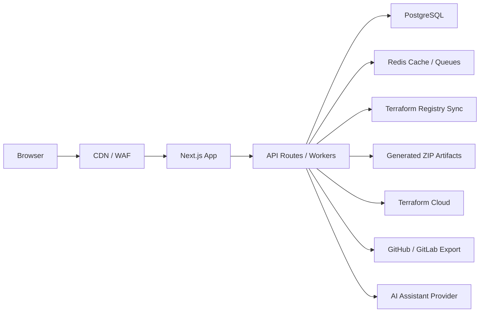

# TerraFactory Architecture

TerraFactory is a Terraform Infrastructure Composer: a visual-first SaaS app that maps infrastructure blocks to reusable Terraform modules and emits deployable project files.

## Application Layers

- UI composer: provider selector, block palette, dynamic forms, React Flow diagram, Monaco Terraform preview, export actions.
- Domain model: provider-agnostic `ProjectState`, `InfraComponent`, `ComponentDefinition`, and `ModuleMapping` types.
- Module registry: maps UI blocks to module sources, versions, required inputs, optional inputs, and implementation notes.
- Generation engine: converts project state into `versions.tf`, `providers.tf`, `main.tf`, `variables.tf`, `outputs.tf`, `terraform.tfvars`, and README content.
- Validation pipeline: validates required fields, production guardrails, state configuration, sensitive values, and future Terraform linting.
- Persistence: PostgreSQL with Prisma for users, teams, projects, generated files, templates, registry modules, and version history.
- Integrations: GitHub/GitLab export, Terraform Cloud, OAuth, and AI assistant services.

## MVP Scope

The current implementation supports AWS, Azure, and GCP with the same abstract block model:

- VPC / VNet / Networking
- Security Groups / NSGs / Firewall Rules
- EKS / AKS / GKE
- RDS PostgreSQL / Azure PostgreSQL Flexible Server / Cloud SQL PostgreSQL
- ElastiCache / Azure Redis / Memorystore
- ALB / Application Gateway / Cloud Load Balancer

AWS includes broad service coverage across the official AWS service categories: EC2, Auto Scaling, Lambda, ECS, Fargate, ECR, Batch, Lightsail, S3, EFS, FSx, AWS Backup, DynamoDB, Aurora, DocumentDB, Neptune, Redshift, OpenSearch, MemoryDB, MSK, SQS, SNS, EventBridge, Step Functions, API Gateway, AppSync, CloudFront, Route 53, ACM, WAF, Shield, Transit Gateway, Direct Connect, Client VPN, VPC Endpoints, IAM, KMS, Secrets Manager, SSM Parameter Store, Cognito, GuardDuty, Security Hub, AWS Config, CloudTrail, CloudWatch, X-Ray, Managed Prometheus, Managed Grafana, Glue, Athena, EMR, Kinesis, Firehose, Lake Formation, QuickSight, SageMaker, Bedrock, Textract, Comprehend, Rekognition, Lex, Polly, CodeBuild, CodePipeline, CodeCommit, CodeDeploy, CloudFormation, Service Catalog, Organizations, Elastic Beanstalk, App Runner, Amplify, SES, Connect, Pinpoint, IoT Core, Greengrass, Transfer Family, DataSync, Migration Hub, and DMS.

For AWS services without a selected hardened registry module yet, TerraFactory emits a complete local module folder under `modules/aws-*`, mirroring the Azure placeholder strategy. These local modules keep exports complete while making the production hardening work explicit.

Azure uses Claranet modules where available, including `claranet/vnet/azurerm`, `claranet/aks-light/azurerm`, `claranet/db-postgresql-flexible/azurerm`, `claranet/redis/azurerm`, `claranet/app-gateway/azurerm`, and `claranet/nsg/azurerm`.

The Azure catalog also includes broad service coverage for common production platforms: Virtual Machines, VM Scale Sets, Storage Accounts, Key Vault, App Service, Function Apps, Container Apps, Container Registry, Container Instances, Front Door, CDN, DNS, Private DNS, Private Endpoints, Public IPs, NAT Gateway, Bastion, VPN Gateway, ExpressRoute, Azure Firewall, Route Tables, Load Balancer, Traffic Manager, MySQL, Azure SQL, Cosmos DB, Event Hubs, Service Bus, API Management, Logic Apps, Data Factory, Synapse, Databricks, Stream Analytics, Event Grid, Log Analytics, Application Insights, Monitor Action Groups, Dashboards, Managed Identity, RBAC, Azure Policy, Defender, Recovery Services Vault, Backup Policies, Automation Account, Cognitive Services, Azure OpenAI, AI Search, Machine Learning, Azure Maps, and Communication Services.

For Azure services without a selected registry module yet, TerraFactory emits a complete local module folder under `modules/azure-*`. These placeholders keep generated projects structurally complete and make it clear where a hardened azurerm implementation or preferred registry module should be installed.

GCP currently uses maintained Google registry modules because Claranet's public Terraform Registry namespace is Azure-heavy and does not expose comparable GCP modules. The abstraction keeps GCP swappable if a preferred module registry is added later.

## Folder Structure

```text
app/
  api/
    assistant/
    generate/
  globals.css
  layout.tsx
  page.tsx
components/
  builder/
    builder-shell.tsx
    code-preview.tsx
    infra-graph.tsx
  ui/
    button.tsx
lib/
  registry/
    aws-components.ts
    azure-components.ts
    catalog.ts
    gcp-components.ts
  terraform/
    hcl.ts
  validation/
    project.ts
  types.ts
prisma/
  schema.prisma
docs/
  api-contracts.md
  architecture.md
  deployment.md
  roadmap.md
```

## Production Deployment Architecture



## Security Notes

- Sensitive Terraform variables are marked `sensitive = true`.
- Secrets should be supplied through environment variables, a secrets manager, or Terraform Cloud variables.
- RBAC is modeled through teams and memberships.
- Registry sync should pin module versions and store checksums.
- Validation should reject public data tiers, wide-open SSH, unencrypted databases, and missing remote state for production.
